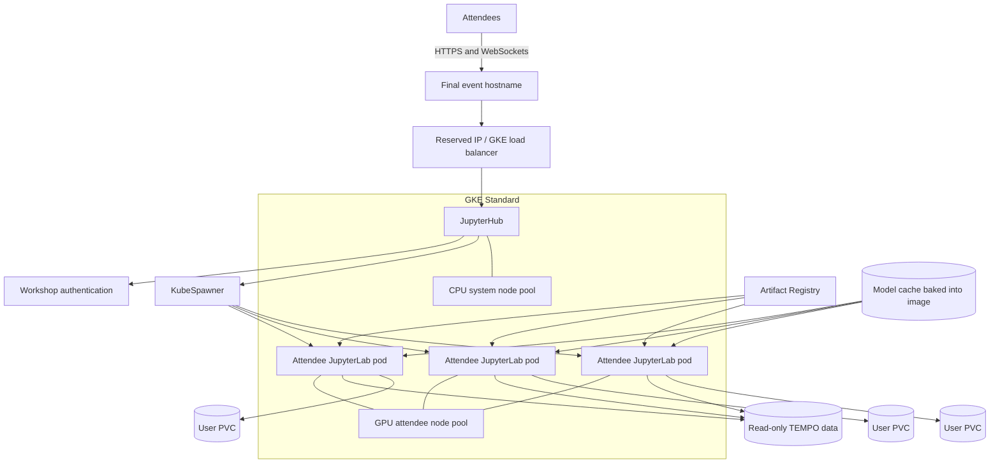

# GPU-Enabled JupyterHub on Google Kubernetes Engine

**Harvard CfA Earth2Studio / NASA TEMPO Hackathon**

**Event:** September 14–16, 2026

**Status:** implementation design and delivery plan
**Release-candidate freeze:** September 4, 2026

## Executive assessment

The proposed platform is feasible for the event. GKE Standard, Zero to JupyterHub, a prebuilt scientific container, shared read-only TEMPO data, and persistent per-user homes are established implementation patterns. The infrastructure itself is not the principal uncertainty.

The go/no-go dependency is the real Earth2Studio/TEMPO workflow. The selected model and notebook determine GPU memory, accelerator type, runtime, storage access, concurrency, and cost. The first release gate is therefore an end-to-end, one-user proof of concept using a representative notebook and real TEMPO data, not completion of the Terraform stack.

Work must proceed in parallel because GPU quota and capacity, institutional DNS, data preparation, notebook development, and container compatibility all have independent lead times. The event supports one GPU-backed attendee environment. Ordinary analysis uses the CPUs attached to each GPU node; loss of schedulable GPU capacity is an infrastructure incident, not a trigger for a second attendee deployment.

## Purpose and attendee experience

The event needs a browser-based scientific environment that attendees can use without installing CUDA, Docker, Earth2Studio, Glue, or TEMPO tooling on their own computers.

The audience consists primarily of scientists with varying levels of coding experience. The environment must support both:

- an accessible, widget-guided path using Glue-Jupyter and prepared notebooks; and
- normal JupyterLab use, including editable cells, terminals, Python experimentation, and extension beyond the prepared workflow.

Each attendee receives a private JupyterLab server, a persistent home directory, the same tested software image, the workshop notebooks, and access to the prepared TEMPO dataset.

The expected workflow is:

1. Open the event URL.
2. Sign in.
3. Start the assigned Earth-2 Lab server.
4. Open the prepared landing notebook.
5. Use the guided widgets or modify and extend the Python workflow.
6. Save work to the persistent home directory.

Attendees will not be asked to choose an accelerator or Kubernetes profile. The operator will publish one tested attendee environment.

Until registration provides a committed cap, infrastructure and venue testing should plan for **50 concurrent attendees**. Final GPU capacity must be recalculated when the attendee cap and selected model are known.

## Scientific scope gate

Earth2Studio provides weather and climate model workflows, but it does not provide an out-of-the-box TEMPO atmospheric-composition workflow. The science team must define how TEMPO participates in the event notebook.

The following must be resolved no later than **August 21**:

- the exact Earth2Studio model and pinned checkpoint;
- inference versus training, with inference currently expected;
- whether TEMPO is a model input, diagnostic/validation dataset, or linked visualization alongside model output;
- the TEMPO product, version, variables, spatial/temporal subset, and preprocessing;
- coordinate and unit transformations between TEMPO and the model;
- expected inference parameters and output products;
- checkpoint and model licensing or authentication requirements;
- ownership of the reference notebooks and their delivery dates.

The August 21 gate succeeds only when a representative notebook runs end-to-end with real TEMPO data and the chosen model, not when Earth2Studio merely imports successfully.

## Architecture

JupyterHub will run in a GKE Standard cluster. The Hub authenticates users and uses KubeSpawner to create one Kubernetes pod per active attendee. Cluster services run on a small CPU node pool. The attendee pods always run on a separate GPU node pool and request one GPU.

Shared, immutable TEMPO inputs and prepared derivatives live in Google Cloud Storage. Each attendee home is a separately provisioned persistent disk. Artifact Registry stores the versioned Earth-2 Lab image with tag immutability enabled, and the release records its resolved digest.



### Degraded operation boundary

Each accelerator-optimized node also supplies CPU and host memory, so a running attendee pod can continue ordinary Python, TEMPO, visualization, and writing work when a model invocation fails. Notebooks must detect CUDA/model failures, preserve the kernel where possible, and present a useful message instead of a raw traceback.

The pod requests `nvidia.com/gpu`, however, so it cannot start when no schedulable GPU is advertised. If GPU nodes, drivers, or reservation-backed capacity cannot run those pods, affected JupyterLab servers remain pending. Operators treat that as a platform incident and restore the single supported environment. The design does not maintain a second CPU-only node pool, Helm configuration, or attendee experience.

Precomputed outputs may still be used for demonstrations and faster scientific iteration, but they are not an availability mechanism. Event resilience comes from reservation-backed capacity, pre-provisioning, tested spare nodes, persistent homes, and an incident runbook.

## Why GKE Standard

GKE Standard provides the controls needed for the event:

- separate CPU and GPU node pools;
- one isolated Kubernetes pod per attendee;
- GPU resource allocation and explicit node placement;
- persistent per-user storage;
- node-pool autoscaling and reservation affinity;
- managed GPU drivers;
- Workload Identity Federation for GKE;
- Cloud Storage and Artifact Registry integration.

A single shared GPU VM would require custom process isolation, lifecycle management, storage mapping, and user accounting. A new shared inference service is also not the default because attendees are expected to inspect and modify code, not merely consume a fixed application API.

The cluster will contain at least:

- a small CPU node pool for the Hub, proxy/ingress, and support services; and
- a tainted GPU node pool used only by attendee workloads.

The design uses a zonal control plane and GPU node pool aligned to the specific capacity reservation. This avoids regional node-pool multiplication and keeps `WaitForFirstConsumer` home volumes in the event zone.

## Deployment ownership: Terraform and Helm

Terraform is the source of truth for Google Cloud infrastructure. Helm manages JupyterHub.

Terraform creates and configures:

- required Google Cloud APIs;
- VPC, subnet, firewall, and IP-planning resources;
- a global reserved public IP for the GKE Ingress; the CfA-provided TLS certificate is uploaded out-of-band so its private key never enters Terraform state;
- the GKE Standard cluster;
- CPU and GPU node pools, labels, taints, drivers, and autoscaling bounds;
- reservation affinity when capacity is reserved;
- minimally privileged node and workload service accounts;
- Workload Identity Federation bindings;
- Artifact Registry;
- Cloud Storage buckets and retention protections;
- persistent-disk storage classes where customization is required;
- monitoring, logging, budget alerts, and relevant outputs.

Helm defines:

- Hub and proxy configuration;
- KubeSpawner behavior;
- the Earth-2 Lab and Hub images pinned by verified registry digest;
- attendee CPU, memory, ephemeral-storage, and GPU requests/limits;
- node selectors and tolerations;
- persistent user storage;
- shared data and model-cache mounts;
- idle culling;
- notebook startup and recovery behavior;
- authentication;
- network policies and service-account selection.

Terraform and Helm should remain separately invocable during development so failures are easy to isolate. Development/rehearsal and event deployments must use separate variables and remote Terraform state. Destruction of compute must not implicitly destroy user data, prepared datasets, or Terraform state.

A practical repository layout is:

```text
tempo-earth2-hackathon/
├── terraform/
│   ├── versions.tf
│   ├── providers.tf
│   ├── variables.tf
│   ├── network.tf
│   ├── gke.tf
│   ├── gpu_node_pool.tf
│   ├── iam.tf
│   ├── artifact_registry.tf
│   ├── storage.tf
│   ├── monitoring.tf
│   └── outputs.tf
├── jupyterhub/
│   ├── values-event.yaml.tmpl
│   └── render_values.py
├── image/
│   ├── Dockerfile
│   └── validation/
├── notebooks/
│   ├── reference/
│   └── validation/
├── data/
│   └── manifests/
└── README.md
```

## Earth-2 Lab container

Container compatibility is an early engineering risk and must be tested independently of GKE. Build the combined image on any suitable NVIDIA GPU before waiting for Terraform or JupyterHub.

The pinned compatibility set must include:

- Earth2Studio release or commit;
- selected model extras and PhysicsNeMo components;
- Python, PyTorch, CUDA runtime, and system libraries;
- the compatible GKE node image and NVIDIA driver branch;
- JupyterLab and `jupyterhub-singleuser`;
- Glue-Jupyter and its widget dependencies;
- xarray, NumPy, pandas, matplotlib, NetCDF/HDF, Zarr, and TEMPO-specific packages.

Earth2Studio recommends CUDA 13 for its current development environment, but that is not a requirement to choose the newest runtime blindly. Use the CUDA/PyTorch/driver combination demonstrated with the selected model, and pin it.

The event image must:

- run as a non-root user without privileged mode;
- start correctly under KubeSpawner;
- contain all runtime dependencies, with no package installation during spawn;
- publish an immutable release tag, record its resolved digest, and deploy only that digest;
- be tested with image streaming and from a fully cold node;
- be pre-warmed on all event nodes even if image streaming is enabled;
- include a command and notebook that report package versions, CUDA visibility, GPU type, data access, cache paths, and writable-home behavior.

### Model and data caches

Earth2Studio defaults model and data caches under the user's home directory. That default must not be used for multi-gigabyte shared model artifacts because it would cause duplicated downloads and storage consumption across attendee PVCs.

Set these variables explicitly:

```text
EARTH2STUDIO_MODEL_CACHE=/opt/earth2/cache/models
EARTH2STUDIO_DATA_CACHE=/home/jovyan/.cache/earth2studio/data
```

Some Earth2Studio data sources also create temporary, per-instance cache directories. Repeated data-source construction can therefore consume and churn ephemeral disk even when the persistent cache location is configured. The validation notebook must measure peak cache and `emptyDir`/container-filesystem use across repeated runs, and the attendee pod must request enough ephemeral storage for that measured behavior.

The event build places the reviewed checkpoint in an immutable image layer at
`/opt/earth2/cache/models`; Cloud Build is configured to fail if that prefetch
does not succeed. Validate concurrent cold starts from the digest-pinned image.
Public NGC or Hugging Face access must not be assumed on event day, and personal
API keys must not be copied into the image or attendee homes. Earth2Studio is
Apache-2.0, but each model and checkpoint must be reviewed under its own license
before redistribution. The selected `nvidia/fourcastnet1` checkpoint is public
for commercial and non-commercial use under Apache-2.0; its pinned Hugging Face
revision is `c67a63995f6c8e0e557eb3d791f32f437e9b02d5`. Record that source,
revision, and license in the release record, and repeat the review if the
selected model changes.

### Notebook distribution and recovery

The image should contain an immutable reference copy of the released notebooks. On first start, a versioned work copy is seeded into the attendee home. Later starts must not overwrite attendee changes.

Provide a clearly documented recovery action that restores a clean work copy from the immutable reference without deleting other user files. The landing page should distinguish reference notebooks, attendee work, generated outputs, and shared input data.

### User package policy and environment recovery

The released system environment and default workshop kernel are part of the immutable container image. Prepared notebooks must not install packages at startup. Attendees may experiment with additional Python packages, but root/system installation and modification of CUDA libraries are not supported.

For event simplicity, permit documented `pip install --user` use or a user-owned virtual environment under the persistent home. Explain that user-installed packages can shadow the released NumPy, xarray, Jupyter, or widget stack and are outside the tested baseline.

Provide a separate **reset user environment** action alongside notebook restoration. It must:

- preserve notebooks, generated data, and the immutable reference copy;
- move, rather than immediately delete, user package directories, user kernels, and documented workshop virtual environments into a timestamped recovery directory;
- restore the released default kernel selection;
- clear only safe, reproducible package caches where necessary; and
- instruct the attendee to restart the kernel or server.

Notebook restoration and environment reset are distinct operations. Neither should require an administrator for the common recovery case.

## GPU selection, isolation, and capacity

### Decision rule

Accelerator and allocation strategy are outputs of the real notebook benchmark.

1. **Dedicated L4 per active attendee** is the preferred simple design if the complete workflow fits comfortably within 24 GB VRAM and has acceptable runtime.
2. If the workflow requires more memory, select a compatible higher-memory GCP accelerator, considering A100, H100, and RTX PRO 6000/G4 availability and demonstrated software compatibility rather than catalog specifications alone.
3. If higher-memory dedicated allocation cannot support the attendee cap, evaluate team-level GPU allocation only with agreement from event organizers and science leads.
4. GPU time-sharing is not the default for attendee-written code because it does not enforce GPU memory limits. Use it only after concurrent testing shows safe headroom and acceptable failure behavior.
5. MIG is considered only when a supported partition provides enough VRAM for the complete workflow.
6. Spot/preemptible GPUs are not used for the primary event capacity.

The model's measured behavior overrides general Earth2Studio hardware recommendations.

### Required benchmark

The proof-of-concept notebook must record:

- accelerator and driver;
- precision and model configuration;
- model/checkpoint cache size;
- peak and steady GPU memory;
- model initialization and cold-cache time;
- warm inference time;
- CPU and host-memory use;
- ephemeral and persistent disk use;
- TEMPO bytes read and access pattern;
- generated output size;
- behavior after repeated runs;
- behavior when multiple users execute the expensive path simultaneously;
- recovery after CUDA OOM or kernel restart.

The final capacity worksheet must state:

- committed attendee cap;
- attendee pods per physical GPU;
- GPUs per node and usable pods per node;
- node count and spare capacity;
- per-pod CPU/RAM/storage requests;
- expected synchronized-load latency;
- event-hours and overnight policy;
- the culling timeout selected for the final GPU allocation model;
- estimated rehearsal and event cost;
- regional quota and confirmed physical capacity.

### Quota and physical capacity

Quota does not guarantee that GPUs will be available in a zone. Request quota for the leading candidate and at least one fallback immediately. Confirm that the Google Cloud credits cover the selected accelerator SKUs and remain valid through the event.

Investigate the shortest practical Compute Engine reservation window that guarantees capacity from the first required pre-warm through the final session. Do not default to a September 13–17 hold. A GKE node pool consuming a specific GPU reservation must use matching reservation affinity and node location. The reservation should include enough spare capacity for the selected upgrade strategy, or upgrades must be disabled/controlled during the event window.

Do not depend on adding dozens of on-demand GPUs one hour before a session. Event capacity must be reserved or already running and verified before September 14.

## Cost estimate and budget controls

### Estimating basis

This is a planning estimate dated **August 14, 2026**, not a quote. It uses public on-demand Linux list prices in `us-central1`, USD, before taxes, negotiated discounts, or promotional credits. The selected event region, accepted reservation price, final node shape, measured storage, and billing-account terms can change the result. Labor, attendee travel, venue costs, and end-user computers are outside this estimate.

The estimate must be regenerated in the [Google Cloud Pricing Calculator](https://cloud.google.com/products/calculator) after the August 21 benchmark fixes the accelerator and node shape. Save the calculator export with the release records. Validate the result against the Cloud Billing Catalog for the actual billing account and region because credits and contract prices do not necessarily match public list prices.

The governing formula is:

> **accelerator capacity cost = billable node count × billable capacity hours × complete accelerator-node hourly rate**

Use the complete machine rate, not a GPU-only add-on price. Accelerator-optimized machine pricing includes the GPU and the machine's CPU and RAM. Reservations are billed for the provisioned capacity during their reservation period even when some or all of it is idle; a consuming VM does not create a second compute charge. Calendar-mode future reservations, where supported and approved, use the returned Dynamic Workload Scheduler price. Until a reservation quote exists, the on-demand rate is a conservative planning proxy.

### Current planning rates

The following public rates are inputs to this estimate, not accelerator-selection recommendations:

| Item | Planning configuration | Public list-price input |
|---|---|---:|
| Preferred L4 attendee node | `g2-standard-8`: 1 L4, 8 vCPU, 32 GiB RAM | $0.853624312/node-hour |
| A100 compatibility alternative | `a2-highgpu-1g`: 1 A100 40 GB, 12 vCPU, 85 GiB RAM | $3.673385/node-hour |
| Higher-memory G4 alternative | `g4-standard-48`: 1 RTX PRO 6000 96 GB, 48 vCPU, 180 GiB RAM | $4.49993/node-hour |
| GKE cluster management | One Standard cluster | $0.10/cluster-hour |
| CPU system node | `e2-standard-4`: 4 vCPU, 16 GiB RAM | approximately $0.13402284/node-hour |
| User homes | Zonal `pd-balanced` | approximately $0.10/GiB-month |
| Single-region Standard GCS | TEMPO, derivatives, and caches | approximately $0.02/GiB-month |
| Load-balancer forwarding rules | First five rules | $0.025/hour, plus processing and egress |

These values come from Google Cloud's [accelerator-optimized VM pricing](https://cloud.google.com/products/compute/pricing/accelerator-optimized), [general-purpose VM pricing](https://cloud.google.com/products/compute/pricing/general-purpose), [GKE pricing](https://cloud.google.com/kubernetes-engine/pricing), [Persistent Disk pricing](https://cloud.google.com/compute/disks-image-pricing), [Cloud Storage pricing](https://cloud.google.com/storage/pricing), and [network pricing](https://cloud.google.com/vpc/network-pricing). Prices and available machine types vary by region.

Do not price H100 capacity as a simple per-GPU multiplication. Available A3 shapes can bundle multiple GPUs, large host-memory allocations, and local SSD, so the actual schedulable GKE node shape must be priced in the calculator.

### Worked 50-attendee scenarios

Until the registration cap is known, assume 50 simultaneous attendees and 10% spare capacity for dedicated allocation: **55 attendee nodes**. Three eight-hour workshop days are **24 GPU-hours per attendee**, or 1,320 L4 node-hours for 55 nodes. This is the correct baseline if the node pool is available only during workshop hours.

Daily pre-warming adds only the hours for which the full pool is actually running. For example, two hours before each day produces 30 billable hours per node: 24 workshop hours plus 6 pre-warm hours. It does not guarantee that 55 on-demand GPUs can be reacquired each morning.

A capacity reservation is different from powered usage. A reservation that runs continuously from the start of an eight-hour day one through the end of an eight-hour day three spans approximately **56 wall-clock hours**, including the two 16-hour overnight gaps. Reserved capacity remains billable while idle. Use the actual workshop start/end timestamps and accepted reservation terms in the final estimate.

| Accelerator allocation scenario | Billable calculation | Accelerator capacity subtotal |
|---|---:|---:|
| Dedicated L4, exactly 50 attendees for 24 hours | 50 × 24 × $0.853624312 | **$1,024** |
| Dedicated L4 with 10% spare, 24 workshop hours | 55 × 24 × $0.853624312 | **$1,127** |
| Dedicated L4 with 10% spare and two-hour daily pre-warm | 55 × 30 × $0.853624312 | **$1,409** |
| Dedicated L4 with a continuous 56-hour capacity hold | 55 × 56 × $0.853624312 | **$2,629** |
| Team-level A100, 13 teams plus 1 spare, 24 hours | 14 × 24 × $3.673385 | **$1,234** |
| Team-level G4, 13 teams plus 1 spare, 24 hours | 14 × 24 × $4.49993 | **$1,512** |
| Dedicated A100, 55 nodes for 24 hours | 55 × 24 × $3.673385 | **$4,849** |
| Dedicated G4, 55 nodes for 24 hours | 55 × 24 × $4.49993 | **$5,940** |

The A100 and G4 rows are financial comparisons only. The benchmark must still demonstrate Earth2Studio, driver, checkpoint, memory, and runtime compatibility. Team allocation also changes the attendee experience and requires organizer approval.

### Event-only infrastructure estimate

The accelerator table above is not the entire event infrastructure bill. For three calendar days with the Hub and supporting services left online for 72 hours, but the GPU pool running only during the 24 workshop hours, the event-only estimate is:

| Event-only component | Calculation or allowance | Estimated cost |
|---|---:|---:|
| Dedicated L4 attendee pool with 10% spare | 55 × 24 × $0.853624312 | $1,127 |
| CPU system pool | 2 × 72 × $0.13402284 | $19 |
| GKE management fee | 72 × $0.10 | $7 |
| 1 TiB of user `pd-balanced` storage | Prorated for 72 hours | $10 |
| 2 TiB of Standard GCS | Prorated for 72 hours | $4 |
| Load balancing, registry, logging, IP, processing, and modest egress | Event allowance pending measurement | $25–$100 |
| **Event-only subtotal before contingency** | | **approximately $1,200–$1,300** |
| **Event-only authorization with contingency** | Rounded operational ceiling | **$1,500** |

This table attributes only the resources consumed during the three event days. It excludes container development, benchmark runs, rehearsals, the cluster before the event, and storage retained afterward. It also assumes GPU nodes really scale down after each session. If they remain allocated overnight or are covered by a continuously billed reservation, replace the $1,127 GPU line with the cost for the full billable capacity window.

### Non-event and non-GPU allowance

For a conservative L4 plan, include the following additional budget before credits:

| Cost component | Planning assumption | Estimated cost |
|---|---|---:|
| Single-GPU development and benchmark time | 120 `g2-standard-8` hours | $102 |
| Two full-concurrency four-hour tests | 55 L4 nodes × 8 hours | $376 |
| CPU system pool | Two `e2-standard-4` nodes for 35 days | $225 |
| GKE cluster management | One cluster for 35 days | $84 |
| User PVC retention | 1 TiB of `pd-balanced` for two months | $205 |
| TEMPO, Zarr, model-cache source artifacts, and derivatives | 2 TiB of single-region Standard GCS for two months | $82 |
| Load balancing, Artifact Registry, logging, operations, IP, and modest egress | Planning allowance pending measured traffic | $150–$300 |

Large browser downloads, cross-region bucket access, extensive Cloud Logging, retained snapshots, or a much larger TEMPO subset require separate line items.

### Full delivery-lifecycle planning envelope

Combining event infrastructure with development, rehearsals, approximately five weeks of the base cluster, two months of retained storage, and a **20% contingency before applying credits** gives these full-project budget ceilings:

| End-to-end planning case | Approximate pre-credit ceiling |
|---|---:|
| Dedicated L4 for the 24 workshop hours | **$3,000** |
| Dedicated L4 with two hours of daily pre-warming | **$3,500** |
| Dedicated L4 with a continuous 56-hour capacity hold | **$5,000** |
| Team-level A100 for the 24 workshop hours | **$3,200** |
| Team-level G4 for the 24 workshop hours | **$3,500** |
| Dedicated A100 for the 24 workshop hours | **$7,500** |
| Dedicated G4 for the 24 workshop hours | **$9,000** |

The expected pre-credit ceiling is **$3,000–$3,500** for the dedicated-L4 design if capacity is billed only during workshop and daily pre-warm hours. Authorize up to **$5,000** if uninterrupted reservation-backed L4 capacity is required across both overnight gaps. These are budget ceilings, not forecasts of the final invoice. If the notebook requires more than 24 GB VRAM, the owners must approve the revised allocation model and budget together.

Credits reduce the amount invoiced but do not reduce resource usage, quota, or the cost exposure if a SKU is excluded. Confirm in writing that the credits remain valid through retention/teardown and apply to Compute Engine GPU SKUs.

### Cost controls and closeout

- Create a dedicated billing budget for the project with notifications at 50%, 75%, 90%, and 100% of the approved pre-credit ceiling. Budget alerts do not cap spending.
- Export detailed billing data and label the cluster, node pools, disks, buckets, reservations, and load balancer with the event and cost-center labels.
- Set explicit GPU node-pool minimums and maximums. Record every temporary increase and its intended rollback time.
- Price the 24 attendee-facing GPU hours separately from the accepted reservation period. Delete ordinary reservations promptly when safe; calendar-mode reservations remain billable through their accepted end time.
- Review costs daily during development and at the end of each event day. Alert on unexpected GPU, egress, logging, snapshot, and orphaned-disk charges.
- Scale the GPU pool down after the event, but do not delete user PVCs until the retention/export decision is confirmed.
- Perform a billing and resource closeout within two business days after the event and again after the user-data retention deadline.

## TEMPO data

### Canonical and optimized copies

Store the original prepared TEMPO subset in an immutable GCS location with:

- product and collection/version identifiers;
- source URLs and retrieval date;
- checksums;
- processing and subsetting provenance;
- the requested NASA dataset citation.

NASA-led mission data are generally open for redistribution unless a product is specifically marked otherwise, but provenance and citation must be preserved.

Publish a workshop-optimized derivative as consolidated Zarr v2 with chunking
aligned to the notebook's time, spatial, and variable selections. Zarr v2 avoids
depending on still-evolving consolidated-metadata behavior in the v3 specification.
Validate that conversion preserves scientific metadata, quality flags, fill
values, coordinates, units, and grouping required by the exercises.

Notebook code should use a configuration value such as `TEMPO_DATA_URI` rather than hard-code attendee-specific paths. A small data-access helper can resolve the production GCS/Zarr URI and a local validation fixture consistently.

### Storage fallback

Cloud Storage FUSE is a supported fallback, not the default assumption for HDF5/netCDF random reads. If the original file representation must be used, test the exact workflow with GCS FUSE caching or stage the hot subset to a read-only persistent or node-local disk.

Do not allow attendee pods to modify canonical inputs. Generated products belong in the user's persistent home. A shared writable output bucket is intentionally omitted because one common attendee identity would allow users to inspect or delete one another's objects.

## User storage

Each attendee receives a dynamically provisioned persistent disk mounted as the Jupyter home directory. Use a `pd-balanced` storage class with `volumeBindingMode: WaitForFirstConsumer` so the disk is created in the zone selected for the attendee pod.

After provisioning, that disk has zonal node affinity. Restrict attendee GPU scheduling to the reservation-backed event zone and test pod replacement on another GPU node in that zone. The saved home must remount without data loss.

Start with 20 GiB per user and adjust after measuring notebooks, model outputs, and the now-explicit Earth2Studio cache locations. Fifty 20-GiB homes require approximately 1 TiB of provisioned capacity.

Per-user PVCs remain the baseline. Filestore would add a new quota, CSI path, shared failure domain, and UID/GID permission model without a demonstrated need at this scale.

Retain user volumes until the event's data-retention deadline. Document whether attendee work will be downloadable, archived, or deleted and prevent infrastructure teardown from silently deleting it.

## Authentication and onboarding

The deployed baseline uses NativeAuthenticator with an explicit registration
username allow-list. Immediately after the first Helm deployment, the named
administrator signs up and is auto-authorized. Registration is then opened for
a short, supervised onboarding window: each allow-listed attendee chooses a
unique password, an administrator authorizes the account, and signup is disabled
again before the event. Keep administrator identities separate from attendees.

Do not put passwords in Terraform, Helm values, source control, or attendee
spreadsheets. Do not use a shared password or DummyAuthenticator. Back up the
Hub database with the same care as credentials, retain it only for the approved
period, and test signup, authorization, logout/login, denied usernames, lost
credentials, server restart, and access from a new browser with several
non-admin accounts.

## Domain, DNS, load balancing, and TLS

Reserve the load-balancer IP before creating the final DNS record. Select and document a single TLS termination path rather than leaving ingress versus proxy load balancing ambiguous.

Use one stable HTTPS hostname under a CfA-managed domain whenever possible.
Domain coordination must begin immediately because institutional ownership and
naming review may take longer than deployment. Terraform reserves a global IP
and records the name of the CfA-provided, self-managed Google Cloud SSL
certificate; Helm configures the external GKE Ingress with that IP and
pre-shared certificate and disables plaintext HTTP. The certificate and private
key are uploaded out-of-band and must never enter Git, Helm values, Terraform
configuration, or Terraform state.

The approved hostname is `living-earth-twin-hub.cfa.harvard.edu`. CfA supplied
a Sectigo certificate whose SAN is exactly that hostname and whose leaf is
valid from September 2, 2026 through March 19, 2027. Its RSA private key matches
the leaf certificate. The provided PEM contains the leaf followed by the
intermediate chain and is the upload artifact; the private key remains a
separate restricted file. Record the institutional renewal owner even though
the certificate remains valid beyond the workshop.

**Contact Michael Chesleigh during deployment planning.** He previously helped with the CosmicDS domain setup and can advise on the CfA subdomain, responsible DNS owner, and established process.

Select the final hostname before applying the event environment. This design
does not maintain parallel hostnames, certificates, or authentication paths.

The deployment sequence is:

1. restrict the supplied private-key file and upload the certificate out-of-band;
2. reserve the public IP;
3. configure the DNS record;
4. establish the load-balancer/ingress path and validate TLS;
5. render Helm values with the exact same hostname;
6. verify redirects, WebSockets, large widget messages, and session cookies using the final hostname.

The hostname used in attendee instructions must be frozen by September 4.

## Security

The deployment is short-lived, but it is still a multi-user code-execution environment. Attendees intentionally receive editable notebooks and may use terminals, so short event duration does not justify relaxing isolation.

Required controls include:

- HTTPS for all attendee traffic;
- non-root containers with privilege escalation disabled;
- no privileged containers or Docker socket access;
- GPU-node taints that keep system workloads off expensive nodes;
- network policies limiting user-pod access to other pods, the Hub, and internal services;
- cloud metadata access blocked except for the controlled Workload Identity path;
- dedicated minimally privileged Kubernetes and Google service accounts;
- no broad project IAM roles or service-account JSON keys;
- read-only access to canonical TEMPO data;
- explicit CPU, memory, ephemeral-storage, persistent-storage, and GPU limits;
- restricted JupyterHub administrator access;
- vulnerability scanning of the frozen image;
- secret handling for Hub, proxy, TLS, and authentication credentials;
- a documented break-glass administrator procedure.

If internet egress remains open for scientific package/data access, monitor for unexpected GPU use and document the trusted-attendee assumption. Time-sharing multiple pods on one GPU does not provide GPU-memory isolation even when Kubernetes network isolation is correct.

## JupyterHub configuration baseline

The canonical configuration is `jupyterhub/values-event.yaml.tmpl`, rendered by
`jupyterhub/render_values.py`. The renderer rejects mutable image tags, invalid
hostnames, an administrator outside the allow-list, and missing Terraform
outputs. Its central scheduling contract is:

```yaml
singleuser:
  image:
    # The chart joins name + ":" + tag into the exact digest reference.
    name: REGION-docker.pkg.dev/PROJECT/REPOSITORY/earth2-lab@sha256
    tag: DIGEST
    pullPolicy: IfNotPresent

  nodeSelector:
    workload: jupyter-gpu

  tolerations:
    - key: workload
      operator: Equal
      value: jupyter-gpu
      effect: NoSchedule

  cpu:
    guarantee: 2
    limit: 4

  memory:
    guarantee: 8G
    limit: 16G

  extraResource:
    guarantees:
      ephemeral-storage: "10Gi"
    limits:
      nvidia.com/gpu: "1"
      ephemeral-storage: "20Gi"

  storage:
    type: dynamic
    capacity: 20Gi
    dynamic:
      storageClass: workshop-user-pd-ENVIRONMENT

  serviceAccountName: TERRAFORM_KSA_NAME

  extraEnv:
    TEMPO_DATA_URI: gs://WORKSHOP_BUCKET/tempo/optimized.zarr
    EARTH2STUDIO_MODEL_CACHE: /opt/earth2/cache/models
    EARTH2STUDIO_DATA_CACHE: /home/jovyan/.cache/earth2studio/data

cull:
  enabled: true
  timeout: 14400
  every: 600

ingress:
  enabled: true
  annotations:
    kubernetes.io/ingress.class: gce
    kubernetes.io/ingress.global-static-ip-name: TERRAFORM_IP_NAME
    ingress.gcp.kubernetes.io/pre-shared-cert: TERRAFORM_TLS_CERTIFICATE_NAME
    kubernetes.io/ingress.allow-http: "false"
  hosts:
    - EVENT_HOSTNAME
```

The illustrative CPU, memory, and ephemeral-storage values above must be replaced by benchmarked values. There is no CPU-only values file; every attendee pod uses this single GPU-requesting profile.

Four hours is the initial value for a one-GPU-per-attendee allocation, not a fixed policy. The final timeout must be selected with the allocation model:

- dedicated capacity sized for every attendee can retain a generous four-hour timeout;
- constrained dedicated capacity may require a shorter timeout plus clear stop/restart guidance;
- time-shared or team-level capacity needs a policy that accounts for all users affected by reclaiming a server.

Test how a long-running, silent kernel updates JupyterHub activity. Do not configure a short maximum server age. Long-running or overnight work must have an explicit event policy, and attendees must save intermediate results to persistent storage.

## Widget, browser, and venue-network validation

Glue-Jupyter demonstration is a hard requirement for the event, not an accessibility nice-to-have: attendees must see and use linked-selection views, not just static Matplotlib output. Pin exact versions and test the real interactions in supported browsers — package installation succeeding is not evidence the interactions work.

**Known blocking defect, confirmed August 21:** the bqplot-image-gl-backed map/image viewer's selection tool crashes in the browser (`TypeError: can't access property "ctrlKey", f.event is null`, thrown from bqplot-image-gl's/bqplot-gl's compiled interaction-binding code) the moment a selection tool is activated on that viewer. This reproduces consistently and is not fixable by re-pinning: bqplot-gl 0.1.1 is the only non-alpha release that exists, so there is no earlier stable version to fall back to. The scatter viewer (plain bqplot, not GL-accelerated) does not execute this code path, and Glue's linked-selection model means a selection made in the scatter view still highlights the corresponding pixels in the map view. The validated interim workaround is to drive selections from the scatter viewer rather than the map viewer until an upstream fix ships; the reference notebook's Glue cell must say this explicitly rather than let an attendee discover the crash on their own.

The validation suite must cover:

- widget initialization after a fresh spawn;
- linked Glue views used in the exercises, **selecting from the scatter view specifically**, since the map view's own selection tool is the confirmed-broken path;
- parameter changes and repeated execution;
- kernel restart and server restart;
- browser refresh;
- malformed or empty selections;
- user-facing handling of CUDA OOM and data errors;
- payload size and browser memory;
- progress visibility during slow model or data operations;
- preservation of notebook work after restart.

Glue is required for the guided path; there is no matplotlib-only fallback for the linked-selection exercise. If the scatter-view workaround does not hold up under further browser testing, escalate immediately rather than quietly reverting to a fallback - either the exercise design or the pinned widget versions need to change, and that decision belongs to the science/notebook owners, not to an unreviewed default.

Before September 4, test in the actual CfA room on the attendee Wi-Fi. Verify at expected concurrency:

- HTTPS and WebSocket stability;
- institutional firewall/proxy behavior;
- browser responsiveness;
- widget traffic and large-output behavior;
- access-point capacity;
- the instructor presentation path.

Keep large TEMPO arrays server-side. Subset or downsample data before transferring it to browser widgets.

## Operations and support

### Before the event

- Confirm GPU reservation or create and verify the complete event node pool.
- Disable or constrain disruptive automatic maintenance during event hours using supported GKE maintenance settings.
- Pre-warm the final image and model cache on every GPU node.
- Run the full validation notebook from a fresh non-admin account.
- Verify every attendee or local credential before distribution.
- Confirm data and user-volume retention protections.
- Prepare any precomputed outputs used by the teaching material and verify graceful in-pod handling of GPU/model errors.
- Record current quotas, node count, GPU health, and budget state.

### Before each event day

- Verify Hub, proxy, TLS, DNS, authentication, and WebSockets.
- Verify every event GPU node is `Ready` and exposes the expected GPU resources.
- Verify Artifact Registry, TEMPO data, model cache, and writable user storage.
- Run a fresh-account smoke test.
- Keep node, pod, PVC, GPU, queue/pending-pod, and budget dashboards visible.

A growing list of `Pending` attendee pods is the clearest capacity or scheduling alarm. The runbook must distinguish GPU exhaustion, reservation/stockout, quota, driver, image-pull, cache, PVC, authentication, and network-policy failures.

### Attendee support

Provide:

- a prepared landing notebook;
- concise startup and recovery instructions;
- a safe restore-clean-notebook action;
- a separate reset-user-environment action that preserves notebooks and generated data;
- visible guidance for kernel restart versus server restart;
- a way to download or export work;
- at least one person focused on attendee/browser support while another monitors infrastructure during high-load periods.

At the end of each day, apply the documented overnight policy. Do not cull or scale down blindly if long-running work has been promised. Retain PVCs until the event and data-retention decisions are complete.

## Ownership and decision register

The August 21 gate cannot be scheduled around an unowned notebook. The event/project lead must replace the placeholders below with named individuals. Assigning the scientific workflow owner is a blocking gate due **August 18**, before the technical proof-of-concept deadline.

| Deliverable or decision | Accountable owner | Due | Acceptance evidence |
|---|---|---|---|
| Earth2Studio model, TEMPO relationship, and scientific acceptance | **TBD — science lead must be named** | August 18 ownership; August 19 scoped draft | Named model/checkpoint, TEMPO product and role, representative inputs/outputs, license/source |
| Reference and validation notebooks | **TBD — notebook lead must be named** | August 18 ownership; August 19 first runnable draft; August 21 PoC | Versioned notebook path that executes the representative workflow |
| Container and GPU benchmark | **TBD — engineering lead must be named** | August 21 | Reproducible image build and benchmark record |
| GCP project, quota, capacity, and credits | **TBD — cloud owner must be named** | Start immediately; status August 18 | Project access, credit/SKU confirmation, quota requests, reservation/capacity record |
| Cost model and budget authorization | **TBD — cloud owner prepares; event/project lead approves** | August 22 provisional; August 28 final | Region-specific calculator export, accepted reservation price/window, credit eligibility, 20% contingency, and approved ceiling |
| CfA hostname and certificate coordination | **Hostname/certificate supplied; DNS-change and renewal owners still TBD** | DNS record after IP allocation; final September 4 | `living-earth-twin-hub.cfa.harvard.edu`, reserved global IP, DNS-change owner, uploaded certificate name, and renewal owner |
| Attendee cap and identity list | **TBD — registration owner must be named** | August 28 | Committed cap and authentication identifiers |
| Venue Wi-Fi and room test | **TBD — venue/network owner must be named** | Test by September 3 | Expected-concurrency browser/WebSocket test record |
| Event-day technical operations | **TBD — operations lead must be named** | September 4 | Staffing schedule, escalation path, and runbook ownership |

If the science or notebook owner is not assigned by August 18, the August 21 gate is at risk regardless of infrastructure progress and must be escalated to the event organizers the same day.

## Parallel delivery plan

The work is organized into parallel tracks rather than eight sequential implementation steps.

### Track A: external lead time

Start immediately:

- establish the credits-backed GCP project;
- verify credit expiration and accelerator SKU eligibility;
- request quota for the candidate and fallback GPUs;
- investigate the shortest reservation/capacity window that covers required pre-warming and all three event days;
- prepare the post-benchmark calculator estimate and obtain budget authorization;
- provide the Terraform-reserved IP to the CfA DNS administrator and obtain the final A record;
- confirm attendee registration and identity collection dates;
- scope and begin TEMPO staging.

### Track B: scientific workflow and container

- assign named science and notebook owners and obtain their model/notebook scope and first runnable draft;
- build the pinned Earth2Studio + Glue-Jupyter image on one GPU;
- run a real or representative TEMPO workflow;
- measure VRAM, RAM, cache, runtime, and I/O;
- validate widgets and editable-code use in multiple browsers;
- decide accelerator, cache placement, and optimized TEMPO representation.

### Track C: infrastructure

- build the Terraform project, network, cluster, node pools, IAM, registry, buckets, and storage;
- install a minimal JupyterHub before the final scientific image is ready;
- establish TLS and the controlled NativeAuthenticator onboarding path;
- implement monitoring, enforced network policies, Workload Identity, and the public HTTPS path.

### Track D: notebooks, usability, and operations

- build the reference and validation notebooks;
- define notebook seeding, notebook restoration, user-package policy, and environment reset;
- prepare any cached outputs used for demonstrations or rapid iteration;
- write attendee instructions and support runbooks;
- test browsers, room Wi-Fi, and simultaneous use.

## Delivery calendar and gates

| Date | Required outcome | Gate |
|---|---|---|
| August 14–18 | Quota and capacity work started; CfA DNS request filed; credits checked; TEMPO scope requested; named science and notebook owners assigned by August 18 | **Ownership gate**; external work is no longer waiting on the proof of concept |
| August 19 | First runnable representative notebook and scoped model/TEMPO path delivered to engineering | Input to the August 21 test exists |
| August 19–21 | Combined image runs on one GPU with real TEMPO data and the representative model/notebook; VRAM, runtime, persistent/ephemeral cache, and I/O recorded; authentication and hostname defaults selected | **Go/no-go for accelerator and scientific scope** |
| August 22 | Region-specific calculator estimate, capacity/reservation window, credit eligibility, contingency, and provisional budget ceiling recorded and approved | **Cost-authorization gate** |
| August 24–28 | Terraform baseline and JupyterHub deployed; real image spawns; TLS/auth/PVC/data/cache work; 5–10 simultaneous-user integration test passes; committed attendee cap and final cost model completed | **Infrastructure and final-budget gate** |
| August 31–September 3 | Test at the committed attendee concurrency, or 50 if still unknown; synchronized notebook path, Wi-Fi, GPU-node failure recovery, and persistent-home recovery tested; runbook complete | **Event-capacity gate** |
| September 4 | Release-candidate image digest, chart, Terraform providers, notebooks, data manifest, hostname, and attendee instructions frozen | **Release-candidate freeze** |
| September 8–9 | Full dress rehearsal from fresh non-admin accounts using the event path | Fixes only afterward |
| September 10–11 | Approved fixes applied and retested; final immutable release selected | **Final freeze** |
| September 13 | Final single-node smoke test complete; credentials, cached outputs, dashboards, and support procedures verified; full event capacity starts only at the approved pre-warm/reservation time | **Operational readiness** |
| September 14–16 | Event | Operate from frozen release and runbook |

## Risk register

| Risk | Response |
|---|---|
| Scientific Earth2Studio/TEMPO relationship remains undefined | Require model, data relationship, and representative notebook by August 21; otherwise postpone or reduce the scientific exercise rather than create an untested second deployment |
| Selected model does not fit on L4 | Benchmark immediately; pivot to a compatible higher-memory GPU and revise allocation/capacity |
| Higher-memory per-user GPUs exceed quota, capacity, or budget | Consider team allocation with organizer approval, reduce concurrent GPU capacity, and use cached outputs where scientifically appropriate |
| GPU quota exists but physical capacity is unavailable | Investigate calendar reservations, target known zones, keep a fallback accelerator/zone, and bring capacity online before the event |
| GPU time-sharing allows one attendee to OOM peers | Prefer dedicated GPUs; use sharing only after concurrent failure testing |
| Container dependency stack cannot be solved | Build on a standalone GPU during the first week; pin a demonstrated CUDA/PyTorch/Earth2Studio/Glue combination |
| Model weights download into every user home | Set explicit Earth2Studio cache variables and pre-populate the model cache |
| Model registry authentication or licensing fails | Review each checkpoint license and cache permitted artifacts before release |
| TEMPO HDF5/netCDF reads are slow from object storage | Publish a validated, consolidated Zarr derivative or stage hot files to read-only disk |
| Glue-Jupyter map viewer's selection tool crashes (confirmed: bqplot-image-gl/bqplot-gl interaction-binding bug, no fixed version available to pin) | Glue is required, not optional - drive linked selections from the scatter viewer, which does not use the affected GL code path; validate this in real-browser testing before the freeze; escalate to science/notebook owners if it does not hold up, rather than defaulting to a matplotlib-only fallback |
| Venue Wi-Fi or WebSockets are unreliable | Test in the actual room at expected concurrency and keep large data transfers server-side |
| Culling either stops scientific work or strands scarce GPUs | Derive the timeout from the final allocation model; start with four hours only for fully dedicated capacity; test silent long-running kernels and publish an overnight policy |
| User cannot recover a modified or broken notebook | Maintain immutable references and a safe restore-clean-work-copy action |
| User-installed packages break the released environment | Keep the system environment immutable, document user installs, and provide a non-destructive reset-user-environment action separate from notebook restoration |
| CfA DNS change is delayed | Reserve the global IP early, give it to the known DNS administrator, and track the final A record before the September 4 freeze |
| Hostname changes late | Treat the Terraform certificate and Helm hostname change as a release change and repeat TLS, redirect, and WebSocket tests |
| Existing PVC cannot remount after GPU pod/node replacement | Keep the attendee pool in the reservation-backed event zone and validate replacement with existing accounts and PVCs |
| Notebook/model work remains unowned until the August 21 gate | Require named science and notebook owners by August 18 and escalate the same day if either remains unassigned |
| Event resources continue generating costs | Use budgets and alerts, document event capacity windows, and destroy compute only after data retention is confirmed |
| Budget alert is mistaken for a spending cap | Treat alerts as monitoring; use explicit node-pool bounds and operator procedures to control spend |
| Public estimate is mistaken for a reservation quote or final bill | Recalculate in the selected region after benchmarking, save the calculator export, price the entire accepted reservation window, and apply credits only after SKU eligibility is confirmed |

## Definition of done

Readiness requires both functional and operational acceptance.

### Functional acceptance

A newly provisioned non-admin attendee can:

1. open the final public URL and authenticate;
2. receive the released Earth-2 Lab server without choosing infrastructure;
3. open the prepared landing notebook;
4. read the released TEMPO dataset;
5. run the representative Earth2Studio inference with GPU acceleration;
6. use the required Glue-Jupyter interactions, including a linked selection made from the scatter viewer (see the known map-viewer defect in the risk register);
7. modify and execute notebook code;
8. save work, stop the server, start it again, and recover the saved work;
9. install an additional user-level Python package using the documented policy;
10. restore the released user environment without losing notebooks or generated data; and
11. restore a clean notebook without operator intervention.

### Operational acceptance

At the committed attendee concurrency, or 50 users if the count is still unknown:

- all users authenticate and spawn within the agreed time;
- the synchronized expensive notebook path completes within the agreed latency;
- GPU memory, node RAM, CPU, disk, and data throughput stay within safe headroom;
- no user loses work after tested kernel, pod, or server recovery;
- an existing home volume remounts after GPU pod and node replacement;
- the actual venue network sustains the browser and widget traffic;
- operators can distinguish and recover from quota, capacity, driver, image, cache, PVC, authentication, and data failures using the runbook;
- GPU/model failure messaging preserves a running kernel where possible, and operators can restore pending servers using the incident runbook;
- the approved calculator export, reservation window, credits/SKU confirmation, billing budget, alerts, and node-pool bounds are recorded with the release; and
- an accountable owner and date are recorded for post-event compute teardown and later user-storage deletion.

The immediate engineering deliverable is therefore an **end-to-end proxy notebook and combined image on one candidate GPU by August 21**, while quota, capacity, DNS, data staging, and Terraform proceed in parallel.

## Primary references

- [Earth2Studio installation and hardware guidance](https://nvidia.github.io/earth2studio/userguide/about/install.html)
- [Earth2Studio model packaging and caching](https://nvidia.github.io/earth2studio/userguide/advanced/auto.html)
- [Zero to JupyterHub configuration reference](https://z2jh.jupyter.org/en/stable/resources/reference.html)
- [GKE GPU sharing behavior](https://docs.cloud.google.com/kubernetes-engine/docs/concepts/timesharing-gpus)
- [GKE consumption of Compute Engine reservations](https://cloud.google.com/kubernetes-engine/docs/how-to/consuming-reservations)
- [GKE persistent volumes and `WaitForFirstConsumer`](https://docs.cloud.google.com/kubernetes-engine/docs/concepts/persistent-volumes)
- [Google Cloud Pricing Calculator](https://cloud.google.com/products/calculator)
- [Accelerator-optimized VM pricing](https://cloud.google.com/products/compute/pricing/accelerator-optimized)
- [GKE pricing](https://cloud.google.com/kubernetes-engine/pricing)
- [Persistent Disk pricing](https://cloud.google.com/compute/disks-image-pricing)
- [Cloud Storage pricing](https://cloud.google.com/storage/pricing)
- [VPC and load-balancer pricing](https://cloud.google.com/vpc/network-pricing)
- [Calendar-mode future-reservation pricing](https://docs.cloud.google.com/compute/docs/instances/future-reservations-calendar-mode-overview)
- [GKE image streaming](https://docs.cloud.google.com/kubernetes-engine/docs/how-to/image-streaming)
- [Cloud Storage FUSE performance guidance](https://docs.cloud.google.com/kubernetes-engine/docs/how-to/cloud-storage-fuse-csi-driver-perf)
- [NASA Earthdata use and citation guidance](https://www.earthdata.nasa.gov/engage/open-data-services-software/data-use-policy)
